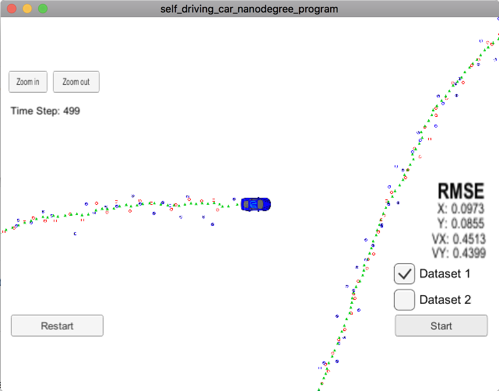

# Project Writeup

This project uses the provided template, and EKF code developed during the video lectures.

`FusionEKF.cpp` implements a sensor fusion algorithm that selects the proper Kalman filter initialization, update and prediction functions for the given data types.

`tools.cpp` contains tools vor converting between cartesian and polar coordinate systems as well as calculating the RMSE

`kalman_filter.cpp` contains the basic Kalman filter code. To note here is that Lidar data uses a basic Kalman filter update function `Update()` and Radar data uses the extened Kalman filter update function `UpdateEKF()` because of the nonlinearities when converting the radar data to the filter's state-space.

## Small Optimizations

Once the value `y` has been calculated, Kalman Filter and EKF do not differ and I thus added a `UpdateCommon()` function that contains the shared code of Kalman filter and EKF.

For computing the Jacobianm, I precomputed some of the terns that get used repeatedly, i.e.,
```  
  float c1 = px*px+py*py;
  float c2 = sqrt(c1);
  float c3 = (c1*c2);
  ```

## Discussion of Filter Output

I evaluated my code with the provided simulator and made a [screen recording of dataset 1](carnd-ekf.mp4). Notably, this video shows the RMSE values as the car is moving along. Although higher at the beginning when the filter gets initialized, the values quickly converge to values that satisfy the project rubric.

The following image shows the RMSE values of the filter after running through dataset 1.


